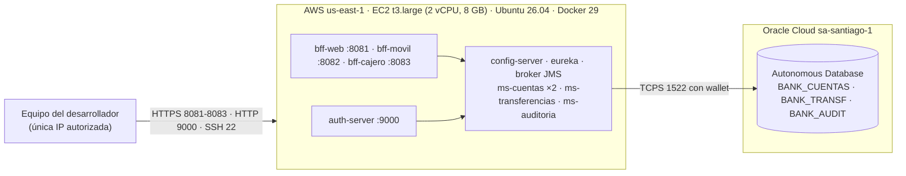

# bank-cloud — PBY2203 Desarrollo Backend III · Experiencia 3, Semana 8

**Desarrollando microservicios y resiliencia en la nube con Spring Cloud**

Actividad sumativa individual · Francisco Javier Parra Andía

Continuidad directa de la semana 7. Allí el ecosistema ya tenía tres BFF, tres microservicios,
Config Server, Eureka, Resilience4j y una Saga de transferencias sobre JMS, pero corría como
diez procesos Java lanzados por un script de PowerShell, con credenciales Basic entre
servicios y un JWT firmado por cada BFF. Esta entrega lo prepara para la nube:

1. **OAuth 2.0** con un servidor de autorización propio (`auth-server`), que reemplaza toda la
   autenticación anterior.
2. **Imágenes Docker** de los diez servicios, desde un solo `Dockerfile` multi-etapa.
3. **Un `docker-compose.yaml`** que orquesta el ecosistema completo, **desplegado en una EC2 de
   AWS contra la Oracle Autonomous Database** de la Experiencia 1.

---

## Índice de la entrega

| Aspecto | Dónde está |
|---|---|
| **1. Código fuente** | `bank-cloud/`, proyecto Maven de 15 módulos, y en <https://github.com/FcoXavierParra/PBY2203_S8_FPARRA> |
| **2. Documentación** | este `README.md`: objetivo (arriba), estructura del código ([sección 10](#10-estructura-del-código)) e instrucciones para ejecutar ([sección 8](#8-cómo-ejecutar)) |
| **3. Evidencia de ejecución** | `evidencias/01_despliegue_ec2_oracle.txt` (la corrida completa en la EC2), `evidencias/02_eureka_ec2.png` y `evidencias/03_broker_topologia.png` |

Cómo se cubre cada criterio de la pauta:

| Criterio | Sección | Evidencia (`01_despliegue_ec2_oracle.txt`) |
|---|---|---|
| 1. OAuth 2.0 con flujo funcional | [2](#2-oauth-20) | secciones 1 y 2 |
| 2. Imágenes Docker de todos los microservicios | [3](#3-imágenes-docker) | sección 0 (diez imágenes) |
| 3. `docker-compose.yaml` que orquesta todo | [4](#4-docker-composeyaml), [5](#5-despliegue-en-aws) | sección 0 (doce contenedores, Eureka) y `02_eureka_ec2.png` |
| 4. Tolerancia a fallos con Resilience4j | [6](#6-tolerancia-a-fallos-con-resilience4j) | secciones 3 a 7 (6 y 7: fallas reales) |
| 5. Mensajería asíncrona con JMS | [7](#7-mensajería-asíncrona-jms) | secciones 2 y 5, y `03_broker_topologia.png` |

---

## 1. Qué cambió respecto a la semana 7

| | Semana 7 | Semana 8 |
|---|---|---|
| Quién autentica a las personas | cada BFF, con usuario y clave en `POST /api/web/login` | el **`auth-server`**, con `authorization_code` + PKCE |
| Quién firma los tokens | cada BFF, con su propia clave HMAC | solo el `auth-server`, con **RS256**; los demás verifican con su clave pública |
| BFF → microservicio | Basic con usuarios `svc-*` | token **`client_credentials`** con scopes, uno por destino |
| Cajero | usuario y PIN contra el BFF | el **terminal** se autentica (`client_credentials`) y el cliente pone su PIN |
| Cómo se levanta | `levantar.ps1`: diez procesos Java en Windows | `docker compose up`: doce contenedores en cualquier máquina con Docker |
| Base de datos | H2 en archivo compartida | **Oracle ADB**, un esquema por microservicio (o H2 para probar sin Oracle) |
| Resiliencia | Circuit Breaker, Retry, outbox | lo mismo + **Bulkhead**, con los umbrales medidos contra la latencia real de la nube |

La lógica de negocio (cuentas, transferencias, saga, auditoría) no cambió. Lo que se
reemplazó es todo lo que estaba atado a "un equipo Windows con todo en localhost".

---

## 2. OAuth 2.0

### El servidor de autorización

`auth-server` (puerto 9000) es un **Spring Authorization Server**, el proyecto oficial de
Spring para OAuth 2.1 / OpenID Connect. Es el único componente que conoce claves de usuarios
y secretos de clientes, y el único que firma tokens:

- Firma con **RS256**. La clave privada no sale del `auth-server`; publica la pública en
  `/oauth2/jwks` y los demás servicios la descargan para **verificar**, sin poder
  **falsificar**. Con la clave HMAC compartida de la semana 7, cualquier servicio que pudiera
  verificar un token también podía emitirlo.
- Publica sus metadatos en `/.well-known/oauth-authorization-server` (evidencia 1.1).
- Clientes, usuarios y secretos llegan desde el Config Server (`config-repo/auth-server.yml`),
  con variables de entorno para reemplazar cada secreto.

### Los dos flujos

**Personas: `authorization_code` + PKCE.** El canal web y el canal móvil son clientes
públicos (una SPA, una app): no pueden guardar un secreto. Por eso usan PKCE, que reemplaza
el secreto por un verificador de un solo uso. La persona escribe su clave **en el
`auth-server`, nunca en el BFF**. El token que recibe dice para qué canal es (`aud`) y de qué
cuenta es titular (claim `cuenta`).

**Máquinas: `client_credentials`.** Cada BFF pide un token por microservicio de destino, solo
con los scopes que ese canal necesita, y lo renueva solo cuando vence. El terminal del cajero
también es una máquina: se autentica él, y la persona agrega su PIN encima.

| Cliente | Tipo | Flujo | Qué obtiene |
|---|---|---|---|
| `canal-web` | público | authorization_code + PKCE | token de persona, `aud=bff-web`, 30 min |
| `canal-movil` | público | authorization_code + PKCE | token de persona, `aud=bff-movil`, 15 min; el ejecutivo no está habilitado |
| `cajero-terminal-01` | confidencial | client_credentials | `cajero.terminal`, 5 min |
| `bff-web` | confidencial | client_credentials | `cuentas.leer`, `transferencias.crear`, `transferencias.leer` |
| `bff-movil` | confidencial | client_credentials | `cuentas.leer` |
| `bff-cajero` | confidencial | client_credentials | `cuentas.leer`, `cuentas.operar` |

Y cada microservicio exige el scope de cada operación:

| Microservicio | Operación | Scope exigido |
|---|---|---|
| `ms-cuentas` | consultar | `cuentas.leer` |
| `ms-cuentas` | retirar | `cuentas.operar` (solo lo tiene el cajero) |
| `ms-transferencias` | crear / consultar | `transferencias.crear` / `transferencias.leer` |
| `ms-auditoria` | consultar el registro | `auditoria.leer` (solo lo tiene la consola de operaciones) |

### Lo que está protegido

- **Un token sirve en un solo canal.** Cada BFF exige su propio `aud`: un token del canal web
  presentado en el BFF móvil, o al revés, recibe **401** (evidencia 2).
- **Cada cliente ve solo su cuenta.** El número de cuenta sale del claim `cuenta` del token,
  nunca de la URL ni del cuerpo: pedir una cuenta ajena da **403**, y el origen de una
  transferencia es siempre la cuenta del token (`AutorizacionCuenta`, en `bank-seguridad`). Es
  la corrección de la observación de la semana 5, ahora con la cuenta firmada por el
  `auth-server`.
- **Solo el ejecutivo ve la cartera completa**, y solo desde el canal web.
- **El cajero exige terminal y PIN.** Sin token de terminal, o con un token de persona, la
  sesión da 401; la sesión queda atada al terminal que la abrió (header `X-Sesion-Cajero`),
  dura 120 s y se cierra al retirar.
- **El privilegio mínimo entre servicios** está en los scopes: `bff-movil` no puede pedir
  `cuentas.operar` (`invalid_scope`, evidencia 1.5), así que un BFF móvil comprometido no
  puede retirar dinero.
- **Ningún secreto está en el repositorio.** Las claves de Oracle, el wallet y la llave SSH
  viven en un `.env` local y en la VM; el `.gitignore` los excluye. Los secretos de cliente
  del `auth-server` tienen valores de desarrollo que se reemplazan por variable de entorno.
- **Se mantiene todo lo anterior:** HTTPS en los tres BFF, permisos por tópico en el broker,
  credencial propia de cada servicio en Oracle.

### Alcance de lo implementado

| | aquí | en producción |
|---|---|---|
| clave de firma RS256 | se genera al arrancar el `auth-server`: los tokens emitidos antes de un reinicio dejan de valer | en un gestor de claves (KMS), con rotación |
| usuarios | tres de prueba en la configuración | un directorio (LDAP, base de usuarios) |
| redirección del flujo de personas | `http://127.0.0.1:8080/callback`, la de una app nativa o de un script | la URL real de la SPA y de la app |
| TLS del `auth-server` | HTTP dentro de la red de Docker; desde afuera, solo desde la IP del desarrollador | HTTPS detrás de un balanceador |
| certificados de los BFF | autofirmados, generados por un contenedor al primer arranque | emitidos por una CA |

---

## 3. Imágenes Docker

Un solo `bank-cloud/Dockerfile` construye las diez imágenes. Tiene dos etapas:

| Etapa | Qué hace |
|---|---|
| `build` | Compila el proyecto Maven completo **una sola vez** (`mvn clean package`, con caché de `~/.m2`) y separa el jar de cada servicio en las capas de Spring Boot |
| `servicio` | Toma las capas de **un** módulo (`--build-arg MODULO=...`) sobre `eclipse-temurin:21-jre` |

Las decisiones, cada una explicada en el propio `Dockerfile`:

- **Compilar dentro de Docker.** Un clon limpio del repositorio se construye en cualquier
  máquina que tenga Docker, sin JDK ni Maven. Es lo que permitió llevarlo a la EC2 tal cual.
- **Una etapa de compilación compartida.** No depende de `MODULO`, así que BuildKit la reusa
  para las diez imágenes: Maven corre una vez, no diez. En la EC2 la construcción completa
  tomó menos de 3 minutos.
- **Capas de Spring Boot.** Las dependencias (~80 MB) quedan en una capa que casi nunca
  cambia; tocar una clase solo reconstruye la capa de la aplicación.
- **JRE, no JDK**, y un **usuario sin privilegios** (`banco`): si el proceso se compromete,
  no es root dentro del contenedor.
- **El heap como porcentaje del límite del contenedor** (`MaxRAMPercentage=65`) y
  `ExitOnOutOfMemoryError`: un servicio sin memoria termina y compose lo reinicia limpio, en
  vez de quedar vivo a medias.

Resultado en la EC2 (evidencia 0): diez imágenes `bank-cloud/<servicio>:s8`, de 539 MB a 649 MB.

---

## 4. docker-compose.yaml

`bank-cloud/docker-compose.yaml` levanta el ecosistema completo: **12 contenedores**, que son
11 servicios con `ms-cuentas` escalado a dos réplicas, más uno que genera los certificados y
termina.

| Servicio | Puerto | ¿Desde afuera? | Memoria | Depende de |
|---|---|---|---|---|
| `certificados` | — | — | — | (genera los keystores TLS de los BFF y termina) |
| `config-server` | 7888 | no | 384 MB | — |
| `eureka-server` | 8761 | solo `127.0.0.1`, por túnel SSH | 448 MB | — |
| `auth-server` | 9000 | **sí** | 448 MB | config-server |
| `broker-mensajeria` | 61616, 8161 | consola solo por túnel SSH | 512 MB | config-server |
| `ms-cuentas` ×2 | 8090 | no | 640 MB c/u | config, eureka, broker |
| `ms-transferencias` | 8091 | no | 512 MB | config, eureka, broker |
| `ms-auditoria` | 8092 | no | 512 MB | config, eureka, broker |
| `bff-web` / `bff-movil` / `bff-cajero` | 8081 / 8082 / 8083 | **sí**, HTTPS | 512 / 448 / 448 MB | certificados, auth-server, microservicios |

**El orden de arranque lo declara compose.** `depends_on` con `condition: service_healthy`
reemplaza la espera que hacía `levantar.ps1`: un servicio no arranca hasta que el
`/actuator/health` de sus dependencias responde UP. Igual, cada servicio tolera que una
dependencia falte después (reintentos contra el Config Server, copia local del registro de
Eureka, outbox con Circuit Breaker): `depends_on` ordena el arranque normal y la resiliencia
cubre el resto.

**Solo se publica lo que es una puerta de entrada:** los tres BFF y el `auth-server`. Config
Server, el JMS del broker y los microservicios existen únicamente dentro de la red `banco`, y
se encuentran por nombre de contenedor.

**Lo que cambia por entorno va en un `.env`**, con la plantilla `bank-cloud/.env.example`.
Ahí se elige la base (`PERFIL_BD=oracle` o `default` para H2), cuántas réplicas de
`ms-cuentas` levantar, la ruta del wallet, las claves de Oracle y los umbrales de latencia
(sección 6). El `.env` no se publica.

**Escalar es cambiar un número.** Las dos réplicas de `ms-cuentas` no declaran puerto propio:
cada una tiene su IP en la red `banco`, se registra en Eureka con ella y comparte la
suscripción JMS con la otra. En la evidencia, Eureka muestra **MS-CUENTAS con dos
instancias UP** (`02_eureka_ec2.png`).

Para cambiar los `localhost` de la semana 7 hubo que externalizarlos en la configuración
(`CONFIG_SERVER_URL`, `EUREKA_URL`, `BROKER_HOST`, `AUTH_SERVER_URL`), con el valor de antes
como default.

---

## 5. Despliegue en AWS



| Pieza | Decisión |
|---|---|
| **Cómputo** | Una EC2 `t3.large` del Learner Lab de AWS Academy. Los doce contenedores usan ~4 GB de 7,6; el compose limita la memoria de cada uno (suman ~5,4 GB) |
| **Red** | El security group solo deja entrar los puertos 22, 8081-8083 y 9000, **desde una sola IP**. Eureka y la consola del broker se ven por túnel SSH |
| **Base** | La misma **Oracle Autonomous Database** de la Experiencia 1, con los datos que dejó su batch (50 cuentas, 401 transacciones, 862 movimientos) |
| **Un esquema por microservicio** | `BANK_CUENTAS`, `BANK_TRANSF` y `BANK_AUDIT`, cada uno con su clave y solo sus tablas (`herramientas/usuarios_oracle_s8.sql`). Ningún servicio usa `ADMIN`: un contenedor que se reinicia en bucle con una clave mala lo bloquearía a los diez intentos |
| **Conexiones** | La ADB es Always Free, con un tope de ~20 sesiones: los pools de Hikari son 4 + 4 + 4 + 3 = 15 |
| **Wallet** | Montado de solo lectura en `/wallet`, fuera de la imagen y del repositorio |

**El costo de la distancia.** La EC2 está en Virginia y la base en Santiago: cada viaje a
Oracle toma **~210 ms**. El Learner Lab solo permite `us-east-1` y `us-west-2`, así que esa
distancia es parte del entorno, y la sección 6 muestra cómo se midió y qué hubo que ajustar.

---

## 6. Tolerancia a fallos con Resilience4j

| Mecanismo | Dónde | Para qué |
|---|---|---|
| **Circuit Breaker** | cada BFF hacia `ms-cuentas` y `bff-web` hacia `ms-transferencias`; el outbox hacia el broker | dejar de llamar a un servicio caído y responder con la degradación propia de cada canal |
| **Retry** | consultas, y la creación de transferencias, que viaja con `Idempotency-Key` | absorber fallas transitorias sin cobrar dos veces |
| **Bulkhead** (nuevo) | cada BFF, un compartimento por servicio de destino | que un servicio lento no se lleve todos los hilos del BFF |
| Fallback | todos los anteriores | 503 con un mensaje del canal, nunca un error crudo |

Los mecanismos de la semana 7 siguen igual (outbox, suscripciones durables, DLQ, reintentos
contra el Config Server). Esta semana se probaron en la nube y contra Oracle, de dos formas:
**fallas reales**, con contenedores detenidos de verdad, y **la latencia** entre regiones.

### Dos fallas reales en la EC2

**`ms-transferencias` se cae** (evidencia 6). Se detiene con `docker compose stop` y nadie
toca `bff-web`:

```
  t=   2 s  transferir -> 503 en 1,56 s  circuito CLOSED    (fallidas 1)   el fallback responde
  t=  17 s  transferir -> 503 en 1,23 s  circuito OPEN      (fallidas 5)   abre al completar 5 llamadas
  t=  20 s  transferir -> 503 en 0,56 s  circuito OPEN      (sin intentar 1) ya ni sale a la red
            consultar una cuenta -> 200                                     el otro circuito no se entera
            ... se vuelve a levantar ms-transferencias ...
  t=  45 s  transferir -> 503            circuito HALF_OPEN                 sonda: el servicio aún arranca
  t=  56 s  transferir -> 503            circuito OPEN                      falla la sonda, vuelve a abrir
  t=  91 s  transferir -> 202 en 2,33 s  circuito HALF_OPEN                 la sonda pasa
  t= 104 s  transferir -> 202 en 1,80 s  circuito CLOSED                    cerrado solo
```

Con el circuito abierto, el canal responde en medio segundo con su mensaje propio
(`"circuitoAbierto": true`) en vez de esperar un timeout, y la consulta de cuentas sigue en
200, porque cada destino tiene su propio circuito y su propio compartimento. Al final, el
saldo bajó exactamente lo de las dos transferencias aceptadas.

**Se cae una de las dos réplicas de `ms-cuentas`** (evidencia 7). Se detiene con
`docker stop`:

| | resultado |
|---|---|
| 10 consultas con una réplica | **10 × 200**, circuito CLOSED. Las nueve primeras tardan ~2,2 s y la décima 1,2 s. Lo más probable es que el balanceador todavía tuviera la réplica caída en su copia del registro: el primer intento fallaba al conectar y el Retry lo repetía contra la viva, hasta que la copia se refrescó |
| una transferencia | 202; la procesó la réplica que quedó, porque la suscripción compartida le entrega a ella todos los eventos |
| al volver la réplica | *healthy* a los 45 s y otra vez **2 instancias de MS-CUENTAS en Eureka**, sin reconfigurar nada |

### El Bulkhead

Un BFF atiende todas sus peticiones con el mismo grupo de hilos de Tomcat. Si
`ms-transferencias` se pusiera lento, cada transferencia en curso ocuparía un hilo hasta su
timeout y, con suficiente tráfico, no quedarían hilos ni para consultar un saldo. El Circuit
Breaker no lo evita, porque *lento* no es *caído* y tarda varias llamadas en abrir.

El Bulkhead pone un tope de llamadas simultáneas por destino: **20 hacia `ms-cuentas` y 5
hacia `ms-transferencias`**. La llamada que excede el tope **no espera**
(`max-wait-duration: 0`): se rechaza al instante con 503 y libera el hilo. Además, el Circuit
Breaker **ignora** esos rechazos (`ignore-exceptions: BulkheadFullException`): un pico de
tráfico es saturación de este lado, no una falla del servicio de destino, y no debe abrir el
circuito contra un servicio sano.

Medido en la EC2, con ráfagas disparadas dentro de la VM (evidencia 4 y 5):

| Ráfaga | Resultado | Circuit Breaker |
|---|---|---|
| 40 fichas de cuenta simultáneas | **31 atendidas, 9 rechazadas** al instante | CLOSED, 0 fallos |
| 15 transferencias simultáneas | **5 aceptadas (202), 10 rechazadas** | CLOSED, 0 fallos |

Y la saga cuadra: el saldo de la cuenta de origen bajó exactamente lo de las transferencias
aceptadas, y nada por las rechazadas.

### Lo que encontró la nube, y cómo se ajustó

La primera medición de las transferencias no salió limpia:

| | timeout 2,5 s · lenta a los 2 s (valores de la semana 7) | timeout 5 s · lenta a los 4 s |
|---|---|---|
| 15 transferencias simultáneas | 2 × 202, 13 × 503 | **5 × 202, 10 × 503** |
| ¿503 en transferencias que sí se registraron? | **sí, 3** | no |
| Circuit Breaker `msTransferencias` | **OPEN** | CLOSED |

Crear una transferencia son varias escrituras en Oracle (transferencia, cupo, outbox), cada
una con ~210 ms de ida y vuelta. Con cinco en paralelo pasaban de los 2,5 s: el BFF cortaba,
respondía 503 y contaba la llamada como fallo, **pero `ms-transferencias` sí la había
registrado y la saga la completaba**. No se perdió ni se duplicó dinero (la saga y la
`Idempotency-Key` lo garantizan), pero un cliente que recibe "no disponible" por una
transferencia que sí se hizo es un error real.

Los umbrales correctos dependen de dónde corre la base, así que pasaron a ser configuración
del despliegue y no del código: `TRANSF_TIMEOUT_LECTURA_MS` y `TRANSF_LLAMADA_LENTA`, con los
valores de la semana 7 por defecto y 5000 ms / 4 s en el `.env` de la EC2. Se cambian sin
recompilar. Queda poco margen: la transferencia más lenta medida tardó 4,9 s. En producción
la solución de fondo es poner el cómputo en la misma región que la base.

Las demás mediciones de latencia:

| Operación | Tiempo en la EC2 | Umbral | Resultado |
|---|---|---|---|
| Saldo por el cajero, medido desde Chile | ~0,9 s, que es casi todo el viaje del cliente a Virginia | lenta a 1 s (cajero) | 10 de 10 OK, **0 lentas**, CLOSED |
| Ficha de una cuenta (bff-web → ms-cuentas) | ~1,0 s sola, ~1,5 s con 16 en paralelo | lenta a 2 s | sin llamadas lentas |
| Cartera completa del ejecutivo | ~1,7 s sola, ~2,4 s con 8 en paralelo | lenta a 2 s | con 8 en paralelo el circuito abre |

La cartera completa son las 50 cuentas, con sus agregados, leídas desde Santiago. Con ocho
ejecutivos pidiéndola a la vez el circuito se abre por lentitud. No se ajustó porque es una
operación de back-office poco frecuente, pero queda documentado como el próximo umbral a
revisar.

---

## 7. Mensajería asíncrona (JMS)

Sin cambios funcionales respecto a la semana 7: una **Saga coreografiada** de transferencias
sobre **ActiveMQ Artemis** (JMS 2.0), con cuatro tópicos de hechos (`banco.transferencia.solicitada`,
`.aplicada`, `.rechazada`, `.cerrada`), outbox transaccional, suscripciones durables y
compartidas, deduplicación en tres capas y cola de mensajes muertos. Los diagramas están en
`diagramas/`:

- `01_topicos_publicadores_consumidores.png`: quién publica y quién consume cada tópico.
- `02_saga_secuencia.png`: la saga en el tiempo, con la compensación.

Lo nuevo es que ahora corre en contenedores y contra Oracle. La consola del broker, al final
de la corrida en la EC2 (`03_broker_topologia.png`):

| Tópico | Suscripción | Consumidores | Recibidos | Confirmados | Pendientes |
|---|---|---|---|---|---|
| `.solicitada` | `ms-cuentas` (compartida) | **2** (las dos réplicas) | 26 | 26 | 0 |
| `.solicitada` | `ms-auditoria.solicitada` | 1 | 26 | 26 | 0 |
| `.aplicada` | `ms-transferencias.aplicada` | 1 | 26 | 26 | 0 |
| `.cerrada` | `ms-auditoria.cerrada` | 1 | 26 | 26 | 0 |
| `DLQ` | — | — | 0 | 0 | 0 |

Las 26 transferencias del día recorrieron la saga completa, sin mensajes pendientes ni
mensajes muertos. Las dos réplicas de `ms-cuentas` se reparten los eventos de la misma
suscripción, que es lo que permite escalarlo horizontalmente.

---

## 8. Cómo ejecutar

### Requisitos

- **Docker** con Compose v2, y unos **6 GB de RAM** para los doce contenedores.
- Para la evidencia: Windows con PowerShell 5.1 y los `curl.exe` y `ssh.exe` que trae el
  sistema.
- No hace falta JDK ni Maven: se compila dentro de Docker.

### Local, con H2 (sin Oracle)

```bash
cd bank-cloud
cp .env.example .env
# en el .env:  PERFIL_BD=default   CUENTAS_REPLICAS=1
#              TRANSF_TIMEOUT_LECTURA_MS=2500   TRANSF_LLAMADA_LENTA=2s
docker compose up -d --build      # la primera vez descarga dependencias: varios minutos
docker compose ps                 # esperar a que los once servicios digan (healthy)
```

Con H2 cada contenedor tiene su propia base en memoria, cargada desde los CSV oficiales. Por
eso, en este modo `ms-cuentas` va con **una** réplica: dos tendrían saldos distintos.

### En una EC2, con Oracle (lo que muestra la evidencia)

1. **La instancia.** Una EC2 `t3.large` con Ubuntu, 30 GB de disco y un security group que
   abra 22, 8081-8083 y 9000 solo desde tu IP. Instala Docker:
   `sudo apt install docker.io docker-compose-v2 docker-buildx`.
2. **Los esquemas.** Como `ADMIN`, en Database Actions, ejecuta
   `herramientas/usuarios_oracle_s8.sql`. Crea los tres usuarios, cada uno con su clave de 12
   caracteres o más, y copia las tablas que dejó el batch.
3. **El código y el wallet.** Copia `bank-cloud/` y el wallet descomprimido a la VM (con
   `scp`). El wallet va fuera de la carpeta del proyecto.
4. **El `.env`.** Copia `.env.example` a `.env` y completa `ORACLE_JDBC_URL`, `WALLET_DIR` y
   las tres claves `CLAVE_BANK_*`. Deja `PERFIL_BD=oracle`, `CUENTAS_REPLICAS=2` y los
   umbrales de latencia que trae la plantilla.
5. **Prueba cada usuario una vez antes de levantar.** `herramientas/ProbarConexion.java`
   valida las credenciales y cuenta las filas. Un servicio que arranca con una clave mala se
   reinicia en bucle y bloquea al usuario a los diez fallos.
6. **Levanta:** `docker compose up -d --build`. En la t3.large los doce contenedores
   quedaron *healthy* en unos 3,5 minutos.
7. **Al terminar:** `docker compose down` y *Stop* de la instancia. La IP pública cambia en
   cada arranque.

### La evidencia

Desde el equipo autorizado, con el ecosistema arriba:

```powershell
cd bank-cloud
.\evidencia_nube.ps1 -Servidor <ip publica> -Llave C:\ruta\llave.pem
```

Genera `evidencias/01_despliegue_ec2_oracle.txt`. **Mueve saldo real** en la base: una
transferencia de $1.000, hasta $600 en transferencias de $100 y un retiro de $10.000 de la
cuenta con más saldo (con Oracle ninguna supera $10.150).

### Probar a mano

Pedir un token de máquina y llamar a un microservicio, desde la VM:

```bash
TOKEN=$(curl -s -u bff-web:bff-web-desarrollo-2026 -d grant_type=client_credentials \
  -d scope=cuentas.leer http://localhost:9000/oauth2/token | sed 's/.*"access_token":"\([^"]*\)".*/\1/')
docker compose exec bff-web curl -s -H "Authorization: Bearer $TOKEN" http://ms-cuentas:8090/interno/cuentas/105
```

El flujo de personas (`authorization_code` + PKCE: autorizar, iniciar sesión, canjear el
código) está implementado paso a paso en `herramientas/oauth_funciones.ps1`, que es el que
usa la evidencia.

Usuarios de prueba: `cliente` / `cliente123` (cuenta 105, web y móvil), `cliente2` /
`cliente456` (cuenta 107) y `ejecutivo` / `ejecutivo123` (cartera completa, solo web). PIN del
cajero: `1234`.

Por túnel SSH (`ssh -L 8761:127.0.0.1:8761 -L 8161:127.0.0.1:8161 ubuntu@<ip>`):

- Eureka: `http://localhost:8761`.
- Topología del broker: `http://localhost:8161/admin/topologia`, con `admin-broker` /
  `admin-broker-2026`. El broker va embebido en Spring Boot y no trae la consola web clásica
  de Artemis: su consola es esta API, protegida con el usuario administrador del broker.

---

## 9. Evidencia incluida

`evidencias/01_despliegue_ec2_oracle.txt`, generada por `bank-cloud/evidencia_nube.ps1`
contra la EC2 con Oracle:

| # | Qué demuestra |
|---|---|
| 0 | La plataforma: la máquina, la configuración del `.env` sin claves, las diez imágenes, los doce contenedores *healthy* con su memoria, y las **ocho instancias en Eureka** (`ms-cuentas` dos veces) |
| 1 | OAuth 2.0: metadatos, `client_credentials` con `aud` y scopes por servicio, secreto equivocado (401), scope no asignado (`invalid_scope`), `authorization_code` + PKCE con el claim `cuenta`, canal no habilitado, canje sin verificador PKCE (401) y clave equivocada |
| 2 | Los tres canales: sin token (401), cuenta ajena (403), token de otro canal (401), transferencia por la saga con el saldo antes y después, y el cajero con terminal, PIN y un retiro autorizado |
| 3 | Latencia de la nube: el Circuit Breaker del cajero sigue cerrado |
| 4 | Bulkhead hacia `ms-cuentas`: 40 simultáneas, 31 atendidas, 9 rechazadas, circuito cerrado |
| 5 | Bulkhead hacia `ms-transferencias`: 15 simultáneas, 5 aceptadas, 10 rechazadas, y el saldo cuadra |
| 6 | **Falla real:** `ms-transferencias` detenido. Fallback 503, el circuito abre a los 17 s, deja de intentar, pasa por HALF_OPEN y cierra solo a los 104 s; las consultas siguen en 200 |
| 7 | **Falla real:** una réplica de `ms-cuentas` detenida. 10 de 10 consultas en 200, la saga sigue con la otra réplica y la detenida vuelve a Eureka |

Capturas de la sesión del 1 de octubre, con el mismo despliegue (la IP pública cambia en cada arranque de la instancia):

- `evidencias/02_eureka_ec2.png`: el panel de Eureka con los siete servicios y las dos
  instancias de `MS-CUENTAS`.
- `evidencias/03_broker_topologia.png`: la topología del broker al final de la corrida.

Datos: los del batch de la Experiencia 1 en Oracle, que salen de `data/semana_3` de
<https://github.com/KariVillagran/bank_legacy_data>. En modo H2 se cargan los mismos CSV
oficiales.

---

## 10. Estructura del código

```
bank-cloud/
├── Dockerfile               NUEVO  multi-etapa: compila una vez, una imagen por servicio
├── docker-compose.yaml      NUEVO  los doce contenedores, red, volúmenes, salud y límites
├── .env.example             NUEVO  plantilla de lo que cambia por entorno
├── evidencia_nube.ps1       NUEVO  genera evidencias/01_despliegue_ec2_oracle.txt
├── config-server/           :7888  config-repo/ con la configuración de todos
├── eureka-server/           :8761
├── auth-server/             NUEVO :9000  Spring Authorization Server, RS256, clientes y usuarios
├── broker-mensajeria/       :61616 Artemis embebido: tópicos, DLQ, permisos, consola /admin
├── bank-contrato/           records compartidos y eventos de la saga
├── bank-eventos/            conversor JSON, suscripciones compartidas, publicador
├── bank-cliente/            clientes HTTP con Circuit Breaker, Retry y, NUEVO, Bulkhead;
│                            TokensServicioConfig pide los tokens client_credentials
├── bank-core/               dominio: cuentas, transferencias, bloqueo pesimista
├── bank-seguridad/          NUEVO contenido: ConversorJwt y AutorizacionCuenta (claim 'cuenta')
├── ms-cuentas/              :8090  ×2 réplicas, resource server con scopes
├── ms-transferencias/       :8091  saga, outbox
├── ms-auditoria/            :8092  registro inmutable de eventos
├── bff-web/ bff-movil/      :8081 / :8082  resource servers, cada uno con su 'aud'
├── bff-cajero/              :8083  terminal por client_credentials + PIN, sesión atada al terminal
└── herramientas/
    ├── usuarios_oracle_s8.sql      los tres esquemas en Oracle
    ├── ProbarConexion.java         prueba unas credenciales de Oracle antes de levantar
    ├── oauth_funciones.ps1         los flujos OAuth 2.0 paso a paso, para la evidencia
    ├── contexto_ec2.sh             sección 0 de la evidencia, se ejecuta en la VM
    └── bulkhead_*.sh               ráfagas simultáneas de las secciones 4 y 5
```

Las decisiones están argumentadas en el javadoc y en los comentarios de donde se toman. Las
que más explican esta semana: `SeguridadAuthConfig` (auth-server), `TokensServicioConfig` y
`ClienteTransferencias` (bank-cliente), `ConversorJwt` (bank-seguridad), el `Dockerfile`, el
`docker-compose.yaml` y `config-repo/bff-web.yml`.
