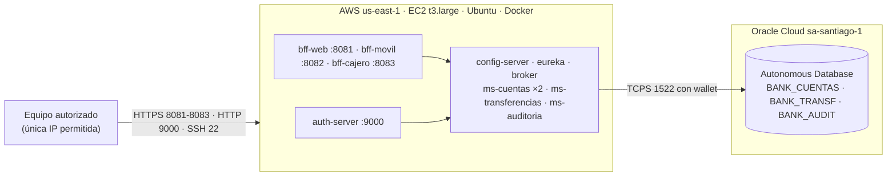

# Despliegue en la nube (AWS)

Banco XYZ · PBY2203 Evaluación Final Transversal · Francisco Javier Parra Andía

El sistema completo se despliega con **Docker Compose en una instancia EC2 de AWS**, contra la
**Oracle Autonomous Database** del banco en Oracle Cloud. Este es el despliegue que muestra
`evidencias/10_nube_ec2_oracle.txt`.

## Topología



## Herramientas y configuración necesarias

| Herramienta | Uso |
|---|---|
| Cuenta de AWS (AWS Academy Learner Lab) | crear la instancia EC2 |
| Oracle Autonomous Database y su **wallet** | base de datos; el wallet habilita la conexión mTLS |
| Cliente SSH (`ssh`, `scp`) y la llave `.pem` de la instancia | administrar la VM y copiar archivos |
| Docker 29+, Docker Compose v2, buildx | construir y orquestar los contenedores en la VM |
| Git | traer el código |

## Paso 1. Crear la instancia EC2

1. En la consola de EC2, **Launch instance**: Ubuntu Server LTS, tipo **t3.large** (2 vCPU,
   8 GB), disco de **30 GB gp3**. Los doce contenedores usan cerca de 4 GB y el compose limita
   la memoria de cada uno.
2. Par de llaves: crear o elegir uno y guardar el `.pem`. En Windows, restringir sus permisos al
   usuario: `icacls llave.pem /inheritance:r /grant:r "%USERNAME%:R"`.
3. **Security group**, reglas de entrada **solo desde tu IP** (`My IP`):

   | Puerto | Para |
   |---|---|
   | 22 | SSH |
   | 8081-8083 | los tres BFF (HTTPS) |
   | 9000 | auth-server (inicio de sesión y tokens) |

   Eureka (8761) y la consola del broker (8161) **no** se abren: se ven por un túnel SSH.
   Config Server, el broker JMS y los microservicios no se publican nunca.
4. Anotar la **IP pública**. Cambia cada vez que la instancia se detiene y se vuelve a iniciar.

## Paso 2. Instalar Docker en la VM

```bash
ssh -i llave.pem ubuntu@<ip-publica>
sudo apt update && sudo apt install -y docker.io docker-compose-v2 docker-buildx
sudo usermod -aG docker ubuntu     # salir y volver a entrar para que tome el grupo
docker --version && docker compose version
```

## Paso 3. Preparar la base de datos

Cada microservicio usa **su propio esquema** con su propia clave; ninguno usa `ADMIN`. Un
servicio que se reinicia en bucle con una clave mala bloquearía al administrador a los diez
intentos.

1. En Oracle Cloud, Database Actions → SQL, como `ADMIN`, ejecutar
   `bank-cloud/herramientas/usuarios_oracle_s8.sql`. Pide tres claves (12 caracteres o más),
   crea `BANK_CUENTAS`, `BANK_TRANSF` y `BANK_AUDIT`, y copia las tablas de cuentas que dejó la
   migración batch.
2. Descargar el **wallet** de la base (Database connection → Download wallet) y copiarlo
   descomprimido a la VM, **fuera** de la carpeta del proyecto:

   ```bash
   scp -i llave.pem -r ./wallet ubuntu@<ip-publica>:~/wallet
   ```

## Paso 4. Traer el código y configurar el entorno

```bash
git clone https://github.com/FcoXavierParra/PBY2203_S9_EFT_FPARRA.git
cd PBY2203_S9_EFT_FPARRA/bank-cloud
cp .env.example .env && chmod 600 .env
nano .env
```

| Variable | Valor en la nube |
|---|---|
| `PERFIL_BD` | `oracle` |
| `ORACLE_JDBC_URL` | `jdbc:oracle:thin:@<servicio>_low?TNS_ADMIN=/wallet` (servicio `_low`, el que admite más sesiones concurrentes) |
| `WALLET_DIR` | `/home/ubuntu/wallet` |
| `CLAVE_BANK_CUENTAS`, `CLAVE_BANK_TRANSF`, `CLAVE_BANK_AUDIT` | las del paso 3 |
| `CUENTAS_REPLICAS` | `2` (escalado horizontal de ms-cuentas) |
| `TRANSF_TIMEOUT_LECTURA_MS` / `TRANSF_LLAMADA_LENTA` | `5000` / `4s`: la base está en otra región (ver "Latencia") |

El `.env` contiene claves: **no se publica** (está en `.gitignore`).

**Antes de levantar, probar cada usuario una sola vez** con `herramientas/ProbarConexion.java`,
que valida la clave y cuenta las filas: así una clave mal escrita gasta un intento y no diez.

## Paso 5. Construir y levantar

```bash
docker compose build          # una etapa de compilación compartida: < 3 min en la t3.large
docker compose up -d
docker compose ps             # esperar a que todos digan (healthy): ~4 min
```

El orden de arranque lo resuelve compose con `depends_on: condition: service_healthy`:
config-server y eureka primero, luego el broker y los microservicios, y al final los BFF.

**Calentar antes de medir:** la primera llamada a cada servicio recién arrancado tarda varios
segundos (carga de clases, conexiones del pool). Una consulta por canal basta.

## Paso 6. Verificar

Desde el equipo autorizado:

```powershell
cd bank-cloud
.\evidencia_nube.ps1 -Servidor <ip-publica> -Llave C:\ruta\llave.pem
```

Genera `evidencias/10_nube_ec2_oracle.txt` con: la plataforma (imágenes, contenedores,
Eureka), OAuth 2.0, los tres canales, la latencia, el Bulkhead y dos **fallas reales**
(ms-transferencias detenido y una réplica de ms-cuentas detenida). **Mueve saldo real** de la
base: transferencias de prueba y un retiro de la cuenta con más saldo.

Paneles, por túnel SSH:

```bash
ssh -i llave.pem -L 8761:127.0.0.1:8761 -L 8161:127.0.0.1:8161 ubuntu@<ip-publica>
# Eureka:  http://localhost:8761
# Broker:  http://localhost:8161/admin/topologia   (admin-broker / admin-broker-2026)
```

## Paso 7. Escalar

```bash
# en el .env: CUENTAS_REPLICAS=3
docker compose up -d ms-cuentas
```

Las réplicas no declaran puerto propio: cada una toma una IP de la red interna, se registra en
Eureka y comparte la suscripción de eventos con las demás. El balanceador de los BFF las
encuentra solo, sin reconfigurar nada.

## Paso 8. Detener (y no pagar de más)

```bash
docker compose down           # los volúmenes (journal del broker, certificados) se conservan
```

Y en la consola de EC2, **Instance state → Stop** (no *Terminate*). Una instancia detenida solo
cobra el disco. La t3.large cuesta USD 0,0832 por hora encendida: las sesiones de prueba de esta
entrega sumaron menos de USD 0,20.

## Latencia entre regiones

El Learner Lab de AWS solo permite `us-east-1` y `us-west-2`, y la base está en Santiago: cada
viaje a Oracle toma ~210 ms. Se midió y se ajustó:

| Operación | Medido en la EC2 | Ajuste |
|---|---|---|
| Crear una transferencia (varias escrituras) | hasta 4,9 s con 5 en paralelo | timeout de 2,5 s → **5 s** y llamada lenta de 2 s → **4 s**, por `.env` y sin recompilar |
| Saldo por el cajero | ~0,9 s desde Chile | ninguno: el circuito del cajero (1 s) sigue cerrado |

En producción la solución de fondo es poner el cómputo en la misma región que la base.

## Problemas conocidos y su solución

| Síntoma | Causa | Solución |
|---|---|---|
| `ssh: connection timed out` | cambió tu IP o la de la instancia | actualizar `My IP` en el security group; revisar la IP pública en la consola |
| `parent snapshot ... does not exist` en el build | carrera de BuildKit entre imágenes que comparten etapa | volver a ejecutar `docker compose build` |
| `ORA-01017` en un microservicio | clave equivocada en el `.env` | corregirla y probarla con `ProbarConexion` antes de levantar |
| 503 en la primera transferencia | arranque en frío | calentar con una consulta antes de medir |
