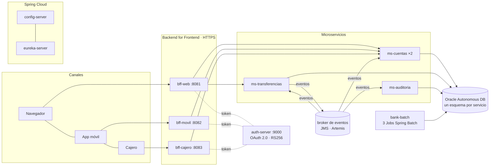

# Banco XYZ — Desarrollo Backend Avanzado: Spring Cloud y Batch

**PBY2203 Desarrollo Backend III · Evaluación Final Transversal** · Francisco Javier Parra Andía

**Código fuente:** <https://github.com/FcoXavierParra/PBY2203_S9_EFT_FPARRA>

Migración del sistema legacy del Banco XYZ (COBOL y scripts Shell en mainframe) a una
arquitectura de microservicios en la nube, en tres partes:

1. **Procesos batch** reescritos en Spring Batch: transacciones diarias, intereses y estados
   de cuenta anuales.
2. **Backend for Frontend** para tres canales: web, móvil y cajero automático.
3. **Microservicios resilientes** con Spring Cloud: configuración centralizada, descubrimiento,
   OAuth 2.0, Resilience4j, mensajería por eventos, Docker y despliegue en AWS.

---

## Documentos de la entrega

| Documento | Contenido |
|---|---|
| `readme.md` | este archivo: visión general, estructura del código y mapa de la entrega |
| [`instrucciones.md`](instrucciones.md) | cómo ejecutar y probar **cada componente**, paso a paso |
| [`despliegue.md`](despliegue.md) | cómo desplegar el sistema en AWS (EC2) con Oracle Autonomous Database |
| `Informe_Tecnico_EFT.pdf` | informe técnico: procesos clave, arquitectura, componentes, diagramas, resultados |
| `evidencias/` | salidas de consola y capturas: `01` a `05` son los procesos batch (corridos en local sobre el dataset oficial); `10` a `12` son el despliegue en AWS EC2 con Oracle Autonomous Database (corrida del 2 de octubre de 2026, mismo código de BFF y microservicios) |
| video MP4 | presentación de 5 a 7 minutos (en la carpeta de entrega de AVA) |

## Arquitectura



Todo corre en contenedores orquestados por `bank-cloud/docker-compose.yaml`, en una EC2 de AWS
contra la Oracle Autonomous Database del banco.

## Cómo se cubre cada parte del enunciado

| Parte | Requerimiento | Dónde está | Evidencia |
|---|---|---|---|
| 1 · Batch | Tres procesos reescritos en Spring Batch, con steps de lectura, proceso y escritura | `bank-batch/`: `transaccionesJob`, `interesesJob`, `anualesJob` | `evidencias/01` a `03` |
| 1 · Batch | Manejo de excepciones y reintentos ante fallos temporales | reintento por chunk con backoff, omisión de filas inválidas con registro de errores, reintento del step | `01` a `03` |
| 1 · Batch | Grandes volúmenes en menos tiempo | modos multihilo y particionado (`bank.escalado.modo`) | `instrucciones.md` §1 |
| 1 · Batch | Políticas de finalización y **reejecución automática** ante fallos críticos | `VerificarConexionConfig`, `CalidadDatosDecider`, `ReejecucionAutomatica` | `04` (falla técnica: relanza) y `05` (datos malos: no relanza) |
| 2 · BFF | BFF web, móvil y cajero, con respuesta propia de cada canal | `bff-web`, `bff-movil`, `bff-cajero` | `10_nube` §2 |
| 2 · BFF | Autenticación y autorización por canal; HTTPS, certificados y tokens | `aud` por canal, claim `cuenta`, terminal + PIN en el cajero, TLS en los tres | `10_nube` §1 y §2 |
| 3 · Microservicios | Cuentas, procesamiento de transferencias, auditoría | `ms-cuentas`, `ms-transferencias`, `ms-auditoria` | `10_nube` |
| 3 · Spring Cloud | Config Server, Eureka, balanceo de carga | `config-server`, `eureka-server`, `lb://` con dos réplicas de ms-cuentas | `11_nube_eureka.png` |
| 3 · Seguridad | OAuth 2.0 con Spring Security | `auth-server` (Spring Authorization Server), scopes por operación | `10_nube` §1 |
| 3 · Resiliencia | Resilience4j y comportamientos alternativos | Circuit Breaker, Retry, Bulkhead y fallback, con fallas reales | `10_nube` §3 a §7 |
| 3 · Eventos | Tópicos, productores y consumidores | saga de transferencias sobre 4 tópicos, outbox, DLQ | `12_nube_broker_topologia.png` |
| 3 · Nube | Docker Compose y despliegue en AWS | `Dockerfile` multi-etapa, `docker-compose.yaml`, EC2 + Oracle ADB | `despliegue.md`, `10_nube` §0 |

### Alcance: lo implementado y lo que queda como siguiente paso

Se priorizó que **cada componente entregado funcione y esté probado** en la nube. Estas son
las brechas conocidas frente al enunciado y cómo se cerrarían:

| Pide el enunciado | Estado | Siguiente paso |
|---|---|---|
| Mensajería con Apache Kafka | Se usa **JMS (ActiveMQ Artemis)** con tópicos, suscripciones durables y compartidas, outbox y DLQ. Cumple el mismo rol: productores y consumidores desacoplados por eventos | Reemplazar el transporte por Kafka (KRaft): la lógica de la saga está aislada en `bank-eventos` |
| Microservicio de Gestión de Clientes | No implementado como servicio propio: los datos del titular viven en `ms-cuentas` | Separarlo en `ms-clientes`, con su esquema y sus eventos |
| Pagos y depósitos | Implementadas las transferencias (saga completa) y los retiros del cajero | Agregar pagos y depósitos sobre la misma saga |
| Apertura y cierre de cuentas | `ms-cuentas` consulta, retira y aplica transferencias | Agregar los endpoints con su evento `cuenta.abierta` / `cuenta.cerrada` |
| Gateway de enrutamiento | El enrutamiento y balanceo los hace Spring Cloud LoadBalancer sobre Eureka (`lb://`) | Spring Cloud Gateway delante de los BFF |
| Escalado horizontal de 3 microservicios | `ms-cuentas` corre con 2 réplicas y se probó la caída de una | Réplicas de ms-transferencias y ms-auditoria |

## Estructura del código

```
bank-cloud/
├── Dockerfile               multi-etapa: compila una vez, una imagen por servicio
├── docker-compose.yaml      12 contenedores: red, volúmenes, salud, límites, réplicas
├── .env.example             plantilla de lo que cambia por entorno (base, réplicas, claves)
├── evidencia_nube.ps1       genera la evidencia de la nube (evidencias/10_nube_ec2_oracle.txt)
├── bank-batch/              PARTE 1: los tres Jobs de Spring Batch
│   └── src/main/java/cl/duoc/bank/batch/
│       ├── transacciones/   reporte de transacciones diarias, detección de anomalías
│       ├── intereses/       cálculo de intereses sobre ahorro y préstamos
│       ├── anuales/         estados de cuenta anuales para auditoría
│       └── common/          omisión, reintentos, particiones, calidad, reejecución automática
├── bff-web/ bff-movil/ bff-cajero/    PARTE 2: un BFF por canal, HTTPS
├── auth-server/             OAuth 2.0 (Spring Authorization Server)
├── config-server/           configuración centralizada (config-repo/)
├── eureka-server/           descubrimiento de servicios
├── broker-mensajeria/       broker de eventos con permisos por tópico
├── ms-cuentas/              cuentas, saldos, retiros; participa en la saga
├── ms-transferencias/       transferencias: saga, outbox, idempotencia
├── ms-auditoria/            registro inmutable de eventos
├── bank-contrato/ bank-cliente/ bank-core/ bank-seguridad/ bank-eventos/   librerías compartidas
└── herramientas/            scripts SQL de Oracle y utilidades de evidencia
```

Las decisiones de diseño están explicadas en el javadoc y los comentarios donde se toman.

## Datos

Procesos batch: dataset oficial <https://github.com/KariVillagran/fin_legacy_data>, carpeta
`data/semana_3`, **cargado por defecto**. Microservicios: las cuentas que la migración batch dejó en Oracle (50 cuentas, 401
transacciones, 862 movimientos), copiadas a un esquema propio por servicio.
